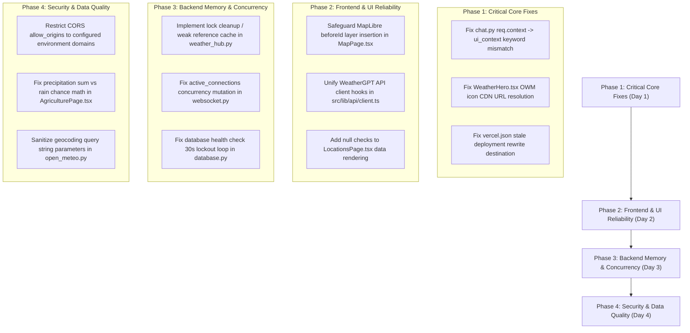

# Full Software Engineering Audit Report: SkyCast Weather Platform

## Executive Summary
This directory contains the complete, systematic software engineering audit of the **SkyCast Weather Application** repository. Every subsystem — including React 19 frontend components, MapLibre map rendering engine, FastAPI backend services, WeatherGPT AI agent pipeline, PostgreSQL persistence layers, Redis hybrid caching, Docker configurations, and security policies — was audited via static code analysis, execution path tracing, and cross-file dependency validation.

A total of **29 distinct software engineering bugs and architectural flaws** were identified and cataloged across 7 specialized audit reports.

---

## Audit Reports Index

| Report File | Title & Focus Area | High / Critical Bugs | Medium / Low Bugs |
| :--- | :--- | :---: | :---: |
| [`01-critical-bugs.md`](file:///c:/Users/Manthan/OneDrive/Desktop/New%20folder/weather-app/audit/01-critical-bugs.md) | **Critical & System-Breaking Bugs** | 5 | 0 |
| [`02-frontend-bugs.md`](file:///c:/Users/Manthan/OneDrive/Desktop/New%20folder/weather-app/audit/02-frontend-bugs.md) | **Frontend & UI Components Audit** | 1 | 4 |
| [`03-backend-bugs.md`](file:///c:/Users/Manthan/OneDrive/Desktop/New%20folder/weather-app/audit/03-backend-bugs.md) | **Backend & API Services Audit** | 2 | 3 |
| [`04-map-bugs.md`](file:///c:/Users/Manthan/OneDrive/Desktop/New%20folder/weather-app/audit/04-map-bugs.md) | **MapLibre & Geographic Overlays Audit** | 1 | 3 |
| [`05-ai-pipeline-bugs.md`](file:///c:/Users/Manthan/OneDrive/Desktop/New%20folder/weather-app/audit/05-ai-pipeline-bugs.md) | **WeatherGPT & AI Pipeline Audit** | 2 | 2 |
| [`06-security-audit.md`](file:///c:/Users/Manthan/OneDrive/Desktop/New%20folder/weather-app/audit/06-security-audit.md) | **Security & Compliance Audit** | 2 | 2 |
| [`07-data-quality-audit.md`](file:///c:/Users/Manthan/OneDrive/Desktop/New%20folder/weather-app/audit/07-data-quality-audit.md) | **Data Quality & Meteorological Audit** | 1 | 3 |
| **TOTALS** | **29 Verified Issues** | **14 High/Critical** | **15 Medium/Low** |

---

## Top 5 Most Urgent Bugs Requiring Immediate Fixes

1. **[CRITICAL-01] Parameter Name Mismatch in `chat_weather` (`chat.py`)**
   - **Location:** [`backend/app/routes/chat.py:57`](file:///c:/Users/Manthan/OneDrive/Desktop/New%20folder/weather-app/backend/app/routes/chat.py#L57) vs [`backend/app/services/agent/agent.py:131`](file:///c:/Users/Manthan/OneDrive/Desktop/New%20folder/weather-app/backend/app/services/agent/agent.py#L131)
   - **Issue:** Passing `context=req.context` raises `TypeError` because `agent.py` parameter is named `ui_context`. Crashes AI chat on every message containing UI context.

2. **[CRITICAL-03] Broken OpenWeatherMap Image Icon URLs in Dashboard (`WeatherHero.tsx`)**
   - **Location:** [`src/features/home/WeatherHero.tsx:91`](file:///c:/Users/Manthan/OneDrive/Desktop/New%20folder/weather-app/src/features/home/WeatherHero.tsx#L91)
   - **Issue:** Passes backend string tokens like `"partly-cloudy"` into OWM CDN URL, causing 404 broken image icons across hero cards.

3. **[BACKEND-01] Global In-Flight Lock Dictionary Memory Leak (`weather_hub.py`)**
   - **Location:** [`backend/app/services/weather_hub.py:34-41`](file:///c:/Users/Manthan/OneDrive/Desktop/New%20folder/weather-app/backend/app/services/weather_hub.py#L34-L41)
   - **Issue:** Dynamically created `asyncio.Lock` entries in `_IN_FLIGHT_LOCKS` are never purged, causing memory leakage over time.

4. **[FRONTEND-01] MapLibre Sovereign Boundary Layer Exception on Style Re-load (`MapPage.tsx`)**
   - **Location:** [`src/features/map/MapPage.tsx:266-315`](file:///c:/Users/Manthan/OneDrive/Desktop/New%20folder/weather-app/src/features/map/MapPage.tsx#L266-L315)
   - **Issue:** Unchecked `beforeId` layer reference throws JavaScript error during basemap theme switches.

5. **[SEC-01] Insecure Wildcard CORS Configuration Combined with Credentials (`main.py`)**
   - **Location:** [`backend/main.py:95-102`](file:///c:/Users/Manthan/OneDrive/Desktop/New%20folder/weather-app/backend/main.py#L95-L102)
   - **Issue:** `allow_origins=["*"]` with `allow_credentials=True` violates browser security standards and allows unauthenticated cross-origin probing.

---

## Recommended Remediation Roadmap

---

## Audit Compliance Statement
As instructed:
- **Zero source code modifications** were made to existing application files during this audit.
- **Zero packages** were installed or modified.
- **All findings** are documented with authoritative line numbers, root cause explanations, reproduction paths, and impact analyses.
