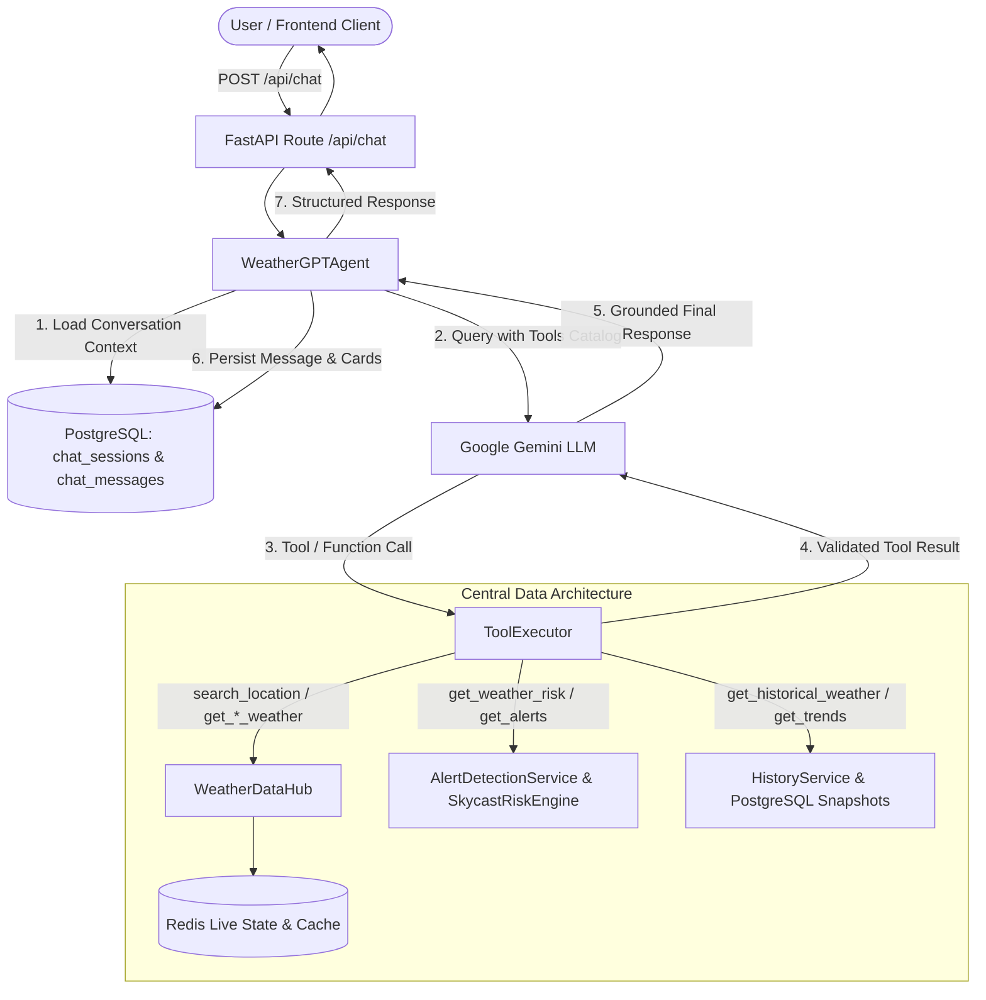

# WeatherGPT AI Weather Agent Documentation

## 1. Overview & Architecture

WeatherGPT is an intelligent meteorological conversational agent for the Skycast Weather platform. It leverages Google Gemini Function Calling coupled with a secure **Tool Execution Pipeline** that interfaces strictly with the **Central Weather Data Hub** and PostgreSQL historical observation storage.



---

## 2. Core Agent Principles

1. **Strict Central Data Grounding**: The agent never communicates directly with external weather providers (Open-Meteo, RainViewer, GFS, WRF). All weather intelligence is pulled exclusively from the Central Weather Data Hub (`WeatherDataHub`), `AlertDetectionService`, and PostgreSQL `HistoryService`.
2. **Meteorological Risk Distinction**: The agent strictly distinguishes between:
   - **Physical Hazard Classification** (e.g. *Heavy Rain*, *Squall*, *Heat Wave*)
   - **Skycast Derived Risk Level** (e.g. *Orange — Be Prepared*, *Yellow — Be Updated*)
   - **Official Government Warnings**: Skycast explicitly clarifies that its derived assessments are computed from numerical forecasts based on published IMD criteria and are **NOT** official IMD or government warnings.
3. **Zero Weather Hallucination**: If numerical weather values or historical observations are missing or unavailable, the agent explicitly states that data is unavailable rather than generating estimates.
4. **Bounded Agent Loop**: The tool execution loop is strictly bounded by `MAX_TOOL_CALLS = 8` to prevent infinite execution cycles or runaway costs.
5. **Deterministic Fallback**: When Gemini API is unavailable or offline, the agent automatically degrades to deterministic rule-based evaluation using the exact same Central Weather Data Hub.

---

## 3. Tool Catalog & Schemas

| Tool Name | Description | Arguments Schema | Backing Service |
| :--- | :--- | :--- | :--- |
| **`search_location`** | Resolves natural-language query to normalized coordinates & region metadata. | `query: str` | `weather_hub.provider.geocode_city` |
| **`get_current_weather`** | Retrieves real-time normalized current weather for a city or coordinate point. | `location: str`, `lat?: float`, `lon?: float` | `weather_hub.get_weather_for_city` / `get_point_weather` |
| **`get_forecast`** | Retrieves hourly and daily forecast projections up to 7 days. | `location: str`, `days?: int`, `hourly?: bool` | `weather_hub.get_weather_for_city` |
| **`get_weather_risk`** | Evaluates Skycast Weather Risk assessment and action directives based on published IMD criteria. | `location: str` | `alert_service.get_alerts_for_city` |
| **`get_weather_alerts`** | Retrieves active alerts across all primary monitored cities or a specific city. | `location?: str` | `alert_service.get_all_active_alerts` |
| **`get_historical_weather`**| Retrieves real historical observation snapshots recorded in PostgreSQL. | `location: str`, `range_days?: int`, `metric?: str` | `HistoryService` (PostgreSQL snapshots) |
| **`get_weather_trends`** | Computes statistical summaries (avg, min, max, total rain) and city comparisons. | `location: str`, `range?: str`, `compare_with?: str` | `HistoryService.get_trends` |
| **`get_map_weather`** | Retrieves summarized GIS layer metrics across all monitored cities. | `{}` | `weather_hub.get_map_weather_dataset` |
| **`get_data_freshness`** | Inspects cache timestamp, data age, and staleness metadata for a location. | `location: str` | `weather_hub.get_data_freshness` |

---

## 4. Security & Prompt Injection Defense

- **Trust Boundaries**: User queries and tool outputs are treated strictly as **DATA**, never as instructions.
- **Whitelist Execution**: Only the 9 registered tool functions in `TOOL_REGISTRY` can be called. Arbitrary Python functions, system commands, or external URLs are rejected with structured errors.
- **Argument Validation**: All tool arguments are strongly validated using Pydantic models with type checking and length limits before execution.
- **Timeouts**: Every tool execution is wrapped in an `asyncio.wait_for(timeout=10.0)` guard.
- **Zero Credential Exposure**: API keys and secrets are never passed into model context, tool arguments, or client response payloads.

---

## 5. PostgreSQL Memory Model

Persistent multi-turn conversation memory is stored in PostgreSQL:

- **`chat_sessions` Table**:
  - `id`: UUID string (Primary Key)
  - `user_id`: Optional user identifier
  - `title`: Session topic or headline
  - `location_context`: Last resolved active location (e.g. Pune)
  - `language`: Conversation language (`en`)
  - `created_at`, `updated_at`: UTC timestamps

- **`chat_messages` Table**:
  - `id`: BigInteger (Primary Key)
  - `session_id`: Foreign Key referencing `chat_sessions.id` (Indexed)
  - `role`: `user`, `model`, `tool`
  - `content`: Message text
  - `tool_name`, `tool_arguments`, `tool_result`: JSON execution logs
  - `created_at`: UTC timestamp (Indexed)

---

## 6. Structured Response Schema (Backward Compatible)

The API response schema maintains 100% backward compatibility with the existing React frontend client while adding rich metadata for future interactive cards:

```json
{
  "reply": "In Pune, it is currently 23°C with cloudy conditions. Rain chance tomorrow is 100%.",
  "city": "Pune",
  "timestamp": "11:45 PM",
  "session_id": "9b1deb4d-3b7d-4bad-9bdd-2b0d7b3dcb6d",
  "cards": [
    {
      "type": "current_weather",
      "data": {
        "temperature": 23,
        "feelsLike": 26,
        "condition": "Cloudy",
        "humidity": 90
      }
    },
    {
      "type": "forecast",
      "data": {
        "day": "Thu",
        "highC": 27,
        "lowC": 23,
        "rainChance": 100
      }
    }
  ],
  "sources": [
    {
      "type": "central_weather_data",
      "timestamp": "2026-08-26T18:15:00Z",
      "provider": "open_meteo"
    }
  ],
  "data_status": "fresh"
}
```

---

## 7. Why LangGraph is Not Currently Required

LangGraph is designed for complex cyclic state machines, human-in-the-loop branching workflows, and multi-agent coordination. WeatherGPT currently operates as a **bounded, single-agent tool orchestration loop**:
- Linear request-response lifecycle with up to $N$ sequential function calls.
- Fast execution with zero external graph framework overhead.
- Direct integration with existing FastAPI async pipelines and PostgreSQL sessions.
- Easier to test, debug, maintain, and audit for security boundaries.

If future product requirements introduce multi-agent debates, hierarchical agent swarms, or asynchronous human approvals, a graph framework can be cleanly integrated on top of the existing `ToolExecutor` and `WeatherDataHub` abstractions.
